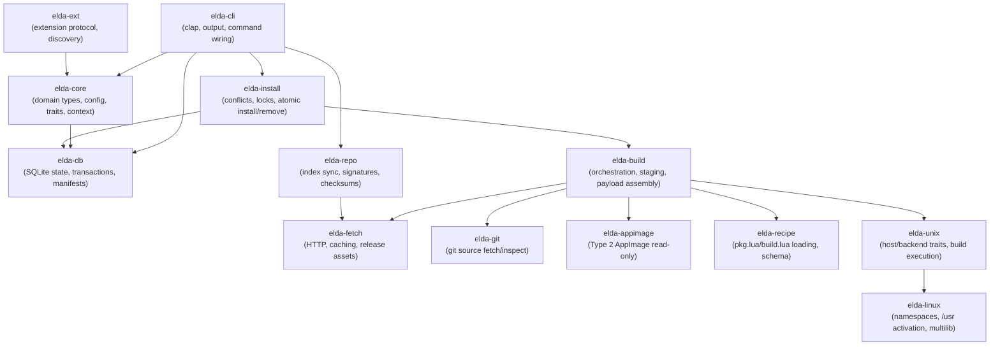

# Elda — Specification
**Version:** 0.1.49-Sumomo
**Date:** 2026-05-18
**Status:** Draft
**Standards:** CODE_STANDARDS.md

Implementation status for shipped vs planned behavior is tracked in `phase.md`. That ledger does
not override runtime behavior defined in this specification.

## 2. Overview
Elda is a Unix-first, Linux-first system package manager written in Rust. It is a hard fork and clean rewrite of `pkgit` under the name Elda.

Elda uses a binary-first, git-capable, CI-native package model. Maintained packages use Lua definitions (`pkg.lua` with optional `build.lua`); ad hoc git installs, vendor binaries, and foreign-package inputs are normalized into the same staged install state and transaction model.

Elda is one conceptual package manager across supported Unix targets. Identity, resolution, state, payload, verification, and transaction semantics are shared across targets; host-specific backends implement activation, build isolation, boot integration, and OS-specific policy.

## 3. Scope
### 3.1 In Scope
- System-level package management for `/usr` with a real installed-state database, file ownership, verification, and transactions.
- `pkg.lua` plus optional `build.lua` package definitions for local recipes and forge-managed packages.
- Binary and vendor installs, git-source installs, and interbuild frontends that normalize into Elda staging.
- PubGrub-style dependency resolution using canonical `epoch:pkgver-pkgrel` ordering.
- A sync-first architecture with explicit concurrency and resolution against verified snapshots.
- A bounded extension system with explicit capability-scoped extension points.
- CI and forge submission workflows for validation, build scheduling, publication, and index updates.
- Interepo foreign-repository consumption through per-repo adapters and native Elda metadata translation.
- A state-composition model with activation backends that preserve one core lifecycle across supported Unix targets.

### 3.2 Out of Scope
- The Nix store model, Nix evaluator model, and NixOS system model.
- **NixOS as an Elda system-management host:** when the runtime detects NixOS (for example `/etc/NIXOS`), Elda refuses system PM operations and directs operators who need ad hoc git-prefix installs to [pkgit](https://git.symlinx.net/pkgit/about/). Nixpkgs **binary/interepo consumption on normal FHS distros** remains in scope; copying NixOS module-generated `/etc` into static files is not.
- macOS and Windows as implementation or delivery targets.
- An async-first core runtime.
- General Portage emulation or arbitrary Nix evaluation as a normal package-maintenance path.
- Bedrock-style permanent coexistence of multiple package managers with separate ownership graphs.

## 4. Package Identity and Versioning
### 4.1 Canonical Identity
| Concept | Definition |
| --- | --- |
| Package identity | `pkgname[:arch] epoch:pkgver-pkgrel` |
| Install origin | Recorded separately from package identity |
| `epoch` default | `0` when omitted |
| `pkgrel` | Package revision; numeric comparison when `pkgver` is equal |
| `package_kind` | `normal` \| `meta` \| `profile` |
| `install_reason` | `base` \| `explicit` \| `dep` |
| `source_kind` | `repo_binary` \| `local_recipe` \| `git` \| `interbuild` \| `interepo` \| `adopted` \| future kinds |

Same-name multiarch packages are modeled explicitly as `pkgname:arch`, not through naming hacks such as `lib32-*`.

### 4.2 Version Comparison
The canonical comparison key is `epoch:pkgver-pkgrel`.

Examples:
- `1:25.0.2-3`
- `0:0.9.2-1`
- `3.4.1-2` means `0:3.4.1-2`

Comparison rules:
1. compare `epoch` numerically
2. compare `pkgver` segment-by-segment
3. compare `pkgrel` numerically if `pkgver` is equal

`pkgver` segment rules:
- split into alternating numeric and alphabetic runs
- separators (`.`, `_`, `+`, `-`) are delimiters, not ordering by themselves
- numeric runs compare numerically
- alphabetic runs compare lexically, case-insensitive
- numeric runs sort newer than alphabetic runs at the same position
- missing trailing segments sort older than present ones

Practical examples:
- `1.10` > `1.9`
- `1.0.0` > `1.0.0rc1`
- `1:1.0-1` > `0:9.9-999`
- `1.2.0-2` > `1.2.0-1`

Metadata rule:
- use `epoch` only when upstream versioning goes backwards or changes scheme badly
- do not overload `pkgrel` with upstream meaning; it is the package revision

## 5. Package Definition Format
### 5.1 Files and Layout
Maintained package definitions use the same structure for local recipes and forge packages.

Local recipe layout:
```text
/etc/elda/recipes/<pkgname>/
  pkg.lua
  build.lua        # optional
  patches/
```

Forge layout:
```text
packages/<pkgname>/
  pkg.lua
  build.lua        # optional
  ci.toml
  patches/
```

### 5.2 `pkg.lua`
`pkg.lua` is the source of truth for identity, dependency edges, flags, split packages, and package policy.

Canonical table shape:
```lua
pkg = {
  name = "fd",
  epoch = 0,
  version = "10.2.0",
  rel = 1,
  arch = { "amd64" },
  kind = "normal",

  source = {
    default_lane = "binary",
    lanes = {
      source = {
        kind = "git",
        url = "https://github.com/sharkdp/fd",
        tag = "v10.2.0",
      },
      binary = {
        kind = "github_release",
        repo = "sharkdp/fd",
        tag = "v10.2.0",
        asset = "fd-v10.2.0-x86_64-unknown-linux-gnu.tar.gz",
        sha256 = "...",
        binary = "fd",
      },
    },
  },

  depends = {},
  makedepends = {},
  checkdepends = {},
  recommends = {},
  suggests = {},
  supplements = {},
  enhances = {},
  provides = {},
  conflicts = {},
  replaces = {},

  conffiles = {},
  sysusers = {},
  tmpfiles = {},
  alternatives = {},
  hooks = {},
  provider_assets = {},

  flags_default = {},
  flags_allowed = {},
  flags_implies = {},
  flags_conflicts = {},
  flags_descriptions = {},
  flags_required_one_of = {},
  flags_required_at_most_one = {},
  flags_required_any_of = {},

  subpackages = {},
}
```

Conditional dependency entries can appear in any dependency family alongside plain string
constraints:

```lua
depends = {
  "shared-runtime",
  { name = "wayland-runtime", when = "+wayland" },
  { name = "x11-runtime",     when = "+x11" },
  { any = { "media-codecs", "media-codecs-free" }, when = "+media,-headless" },
}
```

The `when` predicate gates the dependency against the resolved effective flag set as defined in
§7.3. Cardinality groups (§7.2) are validated after implies/conflicts close.

Architecture labels in `pkg.lua` use Elda's canonical names:
- `amd64`
- `i386`
- `arm64`
- `armhf`
- `riscv64`
- `ppc64le`

Interepo and migration adapters normalize foreign labels into these canonical names. Examples:
- `x86_64` -> `amd64`
- `aarch64` -> `arm64`
- `i686` -> `i386`

Dependency entries use string constraints such as:
- `wayland`
- `libdisplay-info>=0.2.0`
- `mesa<26`
- `openssl=3:3.2.1-1`
- `libfoo:i386>=1.2`

Alternatives use explicit tables:
```lua
depends = {
  { any = { "mesa", "nvidia-utils" } },
}
```

#### Source Schema
`source` defines the package acquisition contract. Simple packages may use a single lane. Maintained packages that expose both an upstream source-build path and an upstream release-binary path should keep one package identity and declare both lanes in one `pkg.lua`.

Author-facing `pkg.lua` source kinds are more specific than the persisted DB/index `source_kind` values in §§8 and 11. Elda normalizes package-definition source metadata into installed/index provenance when the package is built, published, translated, or adopted.

Single-lane form:
- `source.kind` is mandatory
- it selects the fetch/build contract used by the recipe

Multi-lane form:
- `source.lanes` is mandatory
- supported lane keys are `source` and `binary`
- `source.default_lane` is optional and may be `source` or `binary`
- each lane entry uses the same per-kind schema as the single-lane form

Lane rules:
- at least one lane must exist
- `source.lanes.source` should use build-from-source kinds such as `git`, `nix_flake`, or `gentoo_overlay`
- `source.lanes.binary` should use prebuilt-asset kinds such as `url_archive`, `github_release`, `release_asset`, or `appimage`
- separate `foo` / `foo-bin` package names are for genuinely different packages or policy, not merely different acquisition lanes of the same package

Supported source-kind contracts:
| Kind | Required fields | Contract |
| --- | --- | --- |
| `url_archive` | `url`, `sha256` | Direct vendor or upstream archive fetch. Optional fields may describe archive stripping, binary selection, file renames, or subdirectory selection. |
| `github_release` | `repo`, `tag` or `release = "latest"`, `asset`, `sha256` | GitHub release-backed binary/vendor source selected by repo/tag/asset. It accepts the same extraction-selection fields as `url_archive`. |
| `release_asset` | `provider`, `repo`, `tag` or `release = "latest"`, `asset`, `sha256`; optional `host` | Provider-neutral forge release binary (GitLab, Gitea, Forgejo, SourceHut, `direct`, etc.) using the same asset/checksum and multi-arch `assets = { … }` authoring rules as `github_release` where applicable. |
| `appimage` | `binary`, `sha256`, and either direct `url` **or** release-style fields (`repo`, `tag` or `release`, `asset`, optional `provider`, optional `host`; multi-arch `assets = { … }` like `github_release`) | **Type 2** AppImage passthrough: checksum-verified payload stored under `usr/lib/elda/appimages/<pkgname>/<epoch:pkgver-pkgrel>/payload/`, stable launcher as `usr/bin/<binary>` → symlink to that payload. Desktop integration (`.desktop`, icons, `usr/share/metainfo`) is staged by **reading the embedded SquashFS only** (no execution of the AppImage runtime). Optional `integration = "none"` skips that integration; omitting `integration` or `integration = "desktop"` enables it. Does not use archive strip/subdir/rename fields. |
| `git` | `url`, one of `rev` / `tag` / `branch` | Normal git-source recipe. Declarative metadata plus optional `build.lua` define how the checkout is staged. Optional fields may restrict `subdir`, shallow fetch depth, or submodule behavior. |
| `nix_flake` | `url`; optional `rev`, `lockfile`, `installable` | Git-backed interbuild source normalized through the `nix_flake` contract in §12.1. Persisted install provenance becomes `source_kind = interbuild`. |
| `gentoo_overlay` | `url`, `package`; optional `rev`, `binhost`, `use` | Git-backed interbuild source normalized through the `gentoo_overlay` contract in §12.2. Persisted install provenance becomes `source_kind = interbuild`. |

`repo_binary` remains a published/indexed `source_kind` for already-built Elda payloads. It is not the normal handwritten `pkg.lua` source schema for maintained packages.

Shared optional extraction fields for `url_archive` and `github_release`:
- `strip_components`
- `subdir`
- `binary` (Required for binary selection inside archives; CLI metadata generation detects when this is missing and surfaces it in the review gate)
- `rename`

Arch-specific `github_release` authoring:
- the current top-level `asset` plus `sha256` form remains the single-asset shorthand
- multi-arch recipes may instead use `assets = { <arch> = { ... } }` with canonical Elda arch keys such as `amd64` and `arm64`
- each per-arch asset entry must provide `asset` and `sha256`
- `binary`, `strip_components`, `subdir`, and `rename` may be set per asset entry; the top-level fields act as defaults when present
- published metadata must already be resolved to the selected architecture asset and checksum; remote install must not depend on runtime asset guessing

AppImage and git-release metadata selection (ad hoc `elda a` / `elda add` / generated binary lanes): automatic choice among forge release payloads respects `[metadata].release_binary_format_priority` in config. When that list is empty, the implementation uses a default ordering that prefers archives and distro-native packages over `app-image`. When the list is **non-empty**, any format omitted from it (including `app-image`) is excluded from automatic selection. Automatic selection only considers payloads classified as host-compatible for the current machine (`native-exact` / `native-partial`) using filename heuristics; ambiguous or undecidable assets require explicit recipe pinning or operator source-option selection. See `eldastudyappimages.md` for UX and edge-case discussion.

`release = "latest"` rules:
- allowed only for local recipes, vendor imports, and other non-published convenience workflows
- `rc check`, CI publication, and remote indexes must resolve `latest` to a concrete tag, asset, and `sha256`
- published package metadata is always pinned

Ad hoc git normalization rules:
- these rules apply to `elda i <git-url>` or `elda ig <git-url>` when no maintained `pkg.lua` exists yet
- package name defaults to the repository basename after normal URL normalization and optional `.git` stripping
- the normalized installed version is `0.git.<commit_unix>.<shortsha>`
- normalized ad hoc git records use `pkgrel = 1` unless the operator later converts the target into a maintained recipe
- `source_ref` stores the requested git target and `repo_commit` stores the fully resolved commit
- branch or tag names are provenance for ad hoc installs, not version authority; maintained recipes own human-facing package versioning

Ad hoc git upgrade rules:
- plain `elda u` treats installed ad hoc git packages as upgrade candidates only through their persisted `source_ref`, not through synced package indexes
- if `source_ref` tracks a moving branch, including an implicit default-branch install, `elda u` may re-resolve that branch during planning and upgrades only when the resolved commit differs from installed `repo_commit`
- if `source_ref` names a tag or exact revision, plain `elda u` treats that install as pinned to the requested ref and does not auto-advance it
- changing a pinned ad hoc git target requires an explicit new install request or conversion into a maintained recipe
- when an ad hoc git upgrade does occur, the new installed version is re-normalized from the new resolved commit and `repo_commit` is updated accordingly
- when Elda scaffolded package metadata for an ad hoc git install during the current session, interactive human install mode writes that metadata into `/etc/elda/recipes/<pkgname>/`, prints the path, and stops for explicit review before build and activation continue

One-time native recipe snapshot imports:
- `elda a <git-url>` / `elda add <git-url>` may point at a git repository that already contains Elda-native recipe trees, including a single `<pkgname>/pkg.lua` tree or a larger `packages/<pkgname>/pkg.lua` collection
- this path is a metadata snapshot import, not remote registration; it must not create a remote record, alter remote priority, or make future `elda sync` read that URL
- Elda resolves the input to an exact commit, scans for native recipe roots, copies candidate recipe dirs into a temporary import staging root, and presents the normal `[Y/n/e]` review gate before writing local recipes
- `Y` imports the staged set into `/etc/elda/recipes/` and records source URL plus resolved commit as local recipe provenance
- `n` cancels without changing local recipe state
- `e` opens the staged recipe root in the configured editor; after the editor exits, Elda re-scans the remaining dirs, validates them with the same checks as `elda rc check`, recomputes conflicts/counts, and re-prompts
- existing local recipe conflicts fail closed unless the reviewed import explicitly marks the recipe as an update or replacement
- non-interactive imports of ambiguous multi-recipe repos fail closed unless the requested package set is explicit

Lane-selection rules:
- `elda i` selection precedence is: explicit command (`ig` / `ib`), explicit preference flag (`--prefer-source` / `--prefer-binary`), `source.default_lane`, then config `defaults.install_preference`
- `defaults.install_preference` defaults to `binary`
- if the preferred lane is unavailable, Elda falls back to the available declared lane
- `elda ig` fails for package targets that do not expose a source lane
- `elda ib` fails for package targets that do not expose a binary lane and is not valid for raw git-URL installs
- `vendor add` remains the local convenience/import lane for unsupported or one-off binaries; maintained recipes should encode first-class binary lanes directly in `pkg.lua`

#### Declarative Metadata Families
The following fields live in `pkg.lua` and are part of package policy. If a field uses a companion file, the path is package-relative and has no semantics unless `pkg.lua` references it explicitly.

| Field | Representation | Meaning |
| --- | --- | --- |
| `conffiles` | Array of absolute paths under `/etc` | Files that receive conffile handling under §10.2. |
| `sysusers` | Inline entry array or `{ file = "metadata/sysusers.conf" }` | Declarative system user/group creation under §14.2. |
| `tmpfiles` | Inline entry array or `{ file = "metadata/tmpfiles.conf" }` | Declarative runtime directory/file creation under §14.2. |
| `alternatives` | Array of `{ name, link, path, priority }` tables | Command-alternative registrations under §14.2. |
| `hooks` | Table keyed by lifecycle point; each value references a package-relative script or Lua chunk | Exceptional lifecycle hooks under §14.4. |
| `provider_assets` | Table keyed by provider family, then provider name, then asset-entry arrays | Typed provider-specific assets such as init service files under §14.1. |
| `profile` | Table with optional `native_arch`, `foreign_arches`, and `init` keys | Machine-shape defaults attached to a `package_kind = profile` anchor. |
| `description` / `licenses` / `upstream` | Optional short text, license array, and project URL | Human discovery metadata for search/list/info surfaces and synced index records. |

Representative shape:
```lua
conffiles = {
  "/etc/example/example.conf",
},

sysusers = {
  { kind = "user", name = "example", group = "example", system = true },
},

tmpfiles = {
  { type = "d", path = "/var/lib/example", mode = "0750", user = "example", group = "example" },
},

alternatives = {
  { name = "editor", link = "/usr/bin/editor", path = "/usr/bin/nvim", priority = 50 },
},

hooks = {
  post_install = { file = "hooks/post_install.lua" },
},

provider_assets = {
  init = {
    dinit = {
      {
        kind = "file",
        target = "/etc/dinit.d/example",
        file = "providers/init/dinit/example",
      },
    },
    runit = {
      {
        kind = "tree",
        target = "/etc/sv/example",
        dir = "providers/init/runit/example",
      },
    },
  },
},
```

Rules:
- declarative metadata belongs in `pkg.lua`; companion files are optional storage for larger structured inputs, not an implicit second schema
- unreferenced helper files do not participate in package semantics
- metadata that can be expressed declaratively should use these fields instead of lifecycle hooks
- provider-specific service or backend assets use `provider_assets`, not hidden filename conventions or lifecycle-hook guessing
- empty Lua tables `{}` mapping to empty arrays are accepted and ignored for dictionary-typed metadata fields (hooks, flags, etc.) to ensure a smooth authoring experience

- generated package metadata must not silently omit discovery-critical fields; when Elda generates
  metadata from a link, interbuild parser, or foreign adapter, the review report tracks each generated
  `name`, `version`, `description`, `licenses`, `upstream`, `source`, dependency, relationship, and
  variant field as `authoritative`, `derived`, `operator-edited`, or `missing`
- `description`, `licenses`, and `upstream` are required for publish-quality metadata; local-only
  metadata may remain incomplete only after the review gate shows the missing field list and the
  operator accepts it

Declarative common-case build shape:
```lua
build = {
  system = "cargo",
  bins = { "ripgrep" },
  features = { "pcre2" },
  tests = true,
}
```

`build.lua` is for package logic that cannot be expressed by the declarative build table. It is not required just because a package uses Cargo, Meson, CMake, Go, or Zig.

### 5.3 `build.lua`
`build.lua` is optional. It runs inside Elda's embedded Lua environment and stages output into the package root. It must not write directly into `/usr`.

Stable exported build environment:
- `pkgname`
- `pkgver`
- `pkgrel`
- `srcdir`
- `builddir`
- `pkgdir`
- `arch`
- `prefix=/usr`

Rules:
- common build systems should be expressible in `pkg.lua` without `build.lua`
- legacy shell recipes are import and fallback territory, not the documented default
- local recipes and forge packages use the same maintained definition format
- the embedded Lua surface is intentionally small and deterministic: staging helpers, archive/process helpers, structured logging, and metadata inspection are allowed; arbitrary network access, unrestricted process spawning, and writes outside the build root are not
- **Foreign Parse Boundaries**: Elda intentionally bounds its evaluation. It does not bolt on a full `nix` evaluator or shell executor just to parse foreign packages. Instead, it relies on expanding the capabilities of `pkg.lua` and `build.lua` (e.g., standardizing `patch/` directory application and exporting structured environment variables) to translate foreign recipe complexity cleanly into native Elda semantics.

Replacement-grade native build floor:
- pkgit-parity floor: `cargo`, `cmake`, `go`, `make`, `meson`, `nimble`
- first-class Elda-native extensions: `python`, `zig`
- this floor applies to both declarative `build.system` support and ad hoc git build detection before Elda can honestly claim replacement-grade source installs

## 6. Dependency Resolution
Elda uses one dependency model for recipe packages, forge-managed packages, vendor-binary packages, and CI-published packages.

Required dependency fields:
- `depends`
- `makedepends`
- `checkdepends`

Weak dependency fields:
- `recommends`
- `suggests`
- `supplements`
- `enhances`

Resolver rules:
1. `elda sync` produces a merged, verified index snapshot from enabled remotes.
2. installs/upgrades resolve against that snapshot, not against live ad hoc API answers during the transaction.
3. explicit CLI source selection beats implicit source preference.
4. remote priority chooses the winning package source by default; version ordering is meaningful within a chosen priority class, not as an implicit cross-remote merge trick.
5. when a native Elda package and an interepo package are otherwise tied, the native Elda package wins.
6. if two candidates have the same identity and the same `payload_sha256`, they are treated as equivalent copies of the same package record for resolution purposes.
7. if two candidates still tie after source class, priority, and version checks but differ in payload or provenance, resolution fails loudly as ambiguous.
8. exact package names win before virtual `provides`.
9. if more than one package provides the same virtual, provider choice must come from:
   - remote/index policy,
   - user config,
   - or explicit pinning.
10. if provider choice is still ambiguous, resolution fails loudly.
11. unversioned `provides` satisfy only unversioned dependency requests.
12. versioned dependency requests may be satisfied by `provides` only when the provider declares an explicit versioned provide that matches the constraint.
13. `conflicts` blocks co-install unless the transaction removes or replaces the conflicting package in the same plan.
14. `replaces` allows ownership takeover only when the replaced package is in the same transaction plan.
15. weak deps never silently override hard dependency or conflict rules.
16. `recommends` are auto-installed on explicit install by default when satisfiable; `suggests`, `supplements`, and `enhances` are informational unless the operator requests them explicitly.
17. upgrades do not auto-add newly introduced weak dependencies unless the operator uses `--refresh-weak-deps` or enables the matching config policy.
18. Elda resolves against a consistent synced snapshot and should not normalize partial upgrades as a safe everyday mode.
19. `elda u <pkg...>` is allowed, but it upgrades the named package plus whatever dependency closure must move with it from the same snapshot; if that cannot be done coherently, the operation fails.

Additional dependency rules:
- dependency cycles are metadata errors unless they are explicitly modeled as a supported bootstrap pair and handled by the build graph layer
- operations may target one package, but the resolver may pull the rest of that package's closure forward from the same snapshot as needed
- provider choice that remains ambiguous in non-interactive mode is a hard failure
- bootstrap pairs are declared in `ci.toml` or equivalent build-graph metadata, not in end-user package identity; they are toolchain/bootstrap exceptions, not ordinary solver edges

Implementation contract:
- the resolver is a Rust-native crate built from a PubGrub-style explanation model
- `libsolv` is reference material, not a hard dependency

## 7. Flags and Variant Identity
### 7.1 Flag Layers
| Layer | Meaning |
| --- | --- |
| package defaults | Defaults declared in package metadata (`flags_default`) |
| global flags | Machine-wide defaults (`[flags.global]`) |
| profile flags | Defaults attached to a selected profile or system shape (`[flags.profile.<name>]`) |
| package flags | Persistent per-package overrides (`[flags.package.<name>]` and atom-versioned `[flags.package."<name><op><version>"]`) |
| CLI flags | One-shot install or build overrides (`--use=+a,-b`) |

Precedence is low-to-high in the order listed above. Atom-versioned package flag entries only
contribute to the package layer when the resolved candidate's `epoch:pkgver-pkgrel` satisfies the
constraint; non-matching entries are silently skipped (they are not errors).

### 7.2 Recipe Flag Surface
A `pkg.lua` declares its flag surface through the following fields. Every field is optional; the
defaults are empty maps.

| Field | Shape | Semantics |
| --- | --- | --- |
| `flags_default` | `{ flag = bool, ... }` | Default value of every declared flag. |
| `flags_allowed` | `{ flag = bool, ... }` | Allow list. Any flag referenced by global, profile, package, or CLI layers must appear here (or in `flags_default`/`flags_implies`/`flags_conflicts`). |
| `flags_implies` | `{ flag = { flag, ... }, ... }` | Closure rules. Enabling the key flag implies every value flag (transitive). |
| `flags_conflicts` | `{ flag = { flag, ... }, ... }` | Conflict rules. Resolving with both the key and any of the value flags enabled fails closed. |
| `flags_descriptions` | `{ flag = "human description", ... }` | Per-flag descriptions surfaced by `elda fl check` and interactive review. |
| `flags_required_one_of` | `{ group = { flag, flag, ... }, ... }` | Cardinality: exactly one member of the group must be enabled in the resolved set. |
| `flags_required_at_most_one` | `{ group = { flag, flag, ... }, ... }` | Cardinality: at most one member may be enabled. |
| `flags_required_any_of` | `{ group = { flag, flag, ... }, ... }` | Cardinality: at least one member must be enabled. |

Cardinality groups must reference declared/allowed flags and must list at least two members; both
constraints are validated at recipe load time.

### 7.3 Conditional Dependencies
Every dependency family (`depends`, `makedepends`, `checkdepends`, `recommends`, `suggests`,
`supplements`, `enhances`) accepts entries in three shapes:

| Shape | Meaning |
| --- | --- |
| `"name"` or `"name>=ver"` | Unconditional named/versioned constraint. |
| `{ name = "name>=ver", when = "+flag,-other" }` | Conditional constraint; only fed to the solver when every `+`/`-` atom in `when` matches the resolved effective flag set. |
| `{ any = { "alt-a", "alt-b>=2" }, when = "..." }` | Conditional any-of choice with the same `when` semantics. |

The `when` predicate is a comma-separated list of `+flag` (must be enabled) and `-flag` (must be
disabled) atoms. Empty predicates, unknown flag names, and contradictory atoms (e.g. `+x,-x`) are
recipe-time errors. Conditional dependencies that fail their predicate are *invisible* to the
resolver — they do not contribute synthetic providers, do not consume choice slots, and do not
appear in the resulting plan.

### 7.4 Variant Identity Contract
The resolved flag set is part of the build variant identity.

Rules:
- `variant_id == "default"` whenever the resolved effective flags equal `flags_default` (after
  implies and conflicts close); otherwise `variant_id == "v1-<sha256_prefix>"` over the canonical
  `flag=0|1;...` rendering of the resolved set.
- A `customized` boolean accompanies the variant id and controls binary-lane policy: binary lanes
  are forbidden for `customized = true` recipes (the resolver fails closed on `ib` and falls back
  to source on `i --prefer-binary`).
- Cache keys, CI artifacts, payload provenance, and the installed-state record must include the
  resolved variant id.

Binary policy:
- curated profile variants receive CI-published binaries by default (always `default`)
- arbitrary user flag combinations are valid but always imply a local source build
- flag drift must be inspectable through `elda fl check` / `elda fl diff` and rebuildable through
  `elda u --rebuild-variant-drift`

## 8. State and Database
`/etc/elda/recipes/<pkgname>/pkg.lua` is package-definition metadata, not the installed-state database.

### 8.1 Filesystem Layout
| Path | Purpose |
| --- | --- |
| `/etc/elda/` | Policy, remote definitions, local package definitions, keys |
| `/var/lib/elda/db/elda.sqlite` | Authoritative installed-state DB |
| `/var/lib/elda/db/world` | Persisted world anchor set (`base` + `explicit` packages to keep) |
| `/var/lib/elda/db/journal/` | Transaction journals and recovery state |
| `/var/lib/elda/db/manifests/` | Exported per-package manifests / verification snapshots |
| `/var/lib/elda/state/current` | Current active state pointer / activation metadata |
| `/var/lib/elda/states/` | Archived and staged state materialization as supported by the active backend |
| `/var/cache/elda/src/` | Downloaded source tarballs / git mirrors / release assets |
| `/var/cache/elda/pkgs/` | Built binary payloads (`.tar.zst` or equivalent) |
| `/var/tmp/elda/` | Build dirs, transaction staging roots, temp work |

### 8.2 Installed-Package Record
| Field | Meaning |
| --- | --- |
| `pkgname` / `epoch` / `pkgver` / `pkgrel` / `arch` | Installed identity |
| `package_kind` / `variant_id` | `normal` / `meta` / `profile` and resolved build variant |
| `install_reason` | `base` \| `explicit` \| `dep` |
| `source_kind` | `repo_binary` \| `local_recipe` \| `git` \| `interbuild` \| `interepo` \| `adopted` \| future kinds |
| `source_ref` / `remote_name` / `channel` | Release URL, repo name, git URL+revision, interbuild source, interepo repo path, or adopted source-PM identity |
| `foreign_repo` / `foreign_pkgname` / `foreign_pkgver` | Populated for translated/installed interepo packages |
| `mapping_table` / `mapping_version` / `confidence_level` | Translation ruleset identity and verification state for interepo packages |
| `adopted_from_pm` / `adopted_source_name` / `adopted_source_version` / `adopted_source_id` | Populated for migration/adoption records imported from another PM |
| `adopted_source_repo` / `adopted_source_channel` | Original foreign repo/channel when the source PM exposes it |
| `depends` / `provides` / `conflicts` / `replaces` | Resolved hard package edges |
| `recommends` / `suggests` / `supplements` / `enhances` | Resolved weak dependency metadata |
| `shlib_provides` / `shlib_requires` | Auto-detected shared-library edges |
| `build_id` / `repo_commit` | Traceability back to CI or local build |
| `payload_sha256` / `payload_sig` | Payload verification and standalone authenticity |
| `sbom_ref` / `attestation_ref` | Supply-chain metadata pointers |
| `state_id` / `activation_backend` | Which composed state this package belongs to and how it became live |
| `installed_at` | Auditability |
| `manifest_hash` | Lets you verify installed file list and hashes |

Installed means DB record committed, owned-file manifest committed, and payload committed.

### 8.3 State Composition Contract
Universal Elda contract:
1. resolve desired package, provider, and profile state
2. compute owned layout and conflicts
3. stage the next state
4. verify the staged state
5. activate it through the current backend
6. archive the prior state if supported
7. keep a journal and rollback path

Backend-specific materialization differs by host, but the lifecycle contract does not.

Default backend expectations:
- system mode with `prefix = "/usr"` uses the host's system activation backend
- non-system prefixes use a simpler prefix backend with no boot integration and no system-wide `sysusers` / `tmpfiles` side effects
- rollback is required as a user-facing operation only on backends that archive prior states
- system backends stage the next state under `/var/lib/elda/states/<state-id>/` and activate from that staged materialization rather than building directly into the live root
- prefix backends stage under the prefix-specific state root and activate inside that prefix only
- **Unprivileged Prefix Mode**: When configured for a user-owned prefix (e.g., `~/.local`), Elda operates strictly as an unprivileged, non-root package manager. It intentionally bypasses the `sudo`/`doas`/`su` escalation layers completely, allowing users to perform ad-hoc installs and testing safely without system-wide privileges.

### 8.4 World, Bootstrap, Adoption, and Orphans
#### World Tracking
`/var/lib/elda/db/world` is a persisted plain-text anchor set. It lists the packages Elda intends to keep on the machine: every package whose current install reason is `base` or `explicit`.

Rules:
- `dep` packages are not written to `world`; they remain derivable from the installed dependency graph
- `elda why` must be able to explain presence by `base`, `explicit`, dependency path, or active profile/provider anchor
- active profile, init-provider, and multilib policy count as part of the keep-set even when some concrete packages were pulled in as dependencies

#### Bootstrap and Profile Application
Bootstrapping starts from any seed environment that can run Elda: an existing distro, a chroot seed, or a prebuilt bootstrap tarball.

Rules:
- `elda pf apply <profile...>` installs the selected profile anchors into the seeded root and records them with the appropriate `package_kind` and `install_reason = base`
- `elda pf add <profile...>` appends profile anchors onto the current desired profile set, while `elda pf rm <profile...>` removes them explicitly
- profile application also materializes init-provider and foreign-arch/multilib policy as normal Elda state transitions
- `elda pf set-init`, `elda pf clear-init`, `elda pf set-arch`, `elda pf add-foreign-arch`, and `elda pf remove-foreign-arch` mutate the persisted desired machine-shape policy without bypassing the normal profile-state record
- after the first successful profile application, Elda's DB plus `world` become the authoritative machine-state record

#### Adoption and Migration
Elda has both whole-system migration and explicit single-package adoption.

Rules:
- `elda mg from <pm>` imports installed state from another package manager's database
- `elda adopt --from <pm> <pkg>` adopts one package using the same provenance schema
- required migration adapter names in v1 are `pacman`, `apt`, `apk`, `xbps`, and `portage`; `dpkg` is an alias of the `apt`-family adapter
- `nix` is **not** a supported `mg from` / adoption source on NixOS hosts; see §3.2
- adoption reads the source PM database, not just the live filesystem
- adopted packages are recorded with `source_kind = adopted` and keep the source-PM provenance fields from §8.2
- if the source PM exposes repo/channel lineage, Elda records it in `adopted_source_repo` / `adopted_source_channel`
- adoption may pre-populate cache/payload references when local archives are available
- unresolved ownership conflicts fail loudly; adoption never silently claims files
- single-package `adopt` fails if Elda already owns the same package identity or colliding paths; takeover must happen through a normal remove/replace transaction, not by silently merging records
- migration of DKMS packages, kernel modules, initramfs producers, boot loaders, or custom kernels schedules the normal boot/module triggers and marks the resulting transition `reboot-required` when it cannot be completed fully live
- foreign boot-critical packages that cannot be mapped cleanly are imported with explicit warning state and surfaced by `elda check` for manual follow-up

#### Desired-State Export and Import
`elda state show`, `elda state export`, and `elda state import` operate on desired machine shape, not on a byte-for-byte image of the live root.

Rules:
- exported state captures the world anchor set, install reasons, active profile anchors, provider choices, architecture/multilib policy, and enabled remotes/channels needed for reproduction
- exported state is intent; import still resolves through the normal sync, solver, staging, and activation path on the target machine
- desired-state import never bypasses normal verification, conflict detection, or transaction journaling

#### Meta and Profile Package Behavior
`package_kind = meta` and `package_kind = profile` are first-class package types.

Rules:
- meta/profile packages may omit `build.lua` and own no normal filesystem payload unless they also ship explicit declarative profile assets
- they install by ensuring their dependency closure is satisfied
- the package DB records them with an empty manifest or explicit no-payload marker
- `package_kind = profile` recipes may additionally declare `profile = { native_arch?, foreign_arches?, init? }` in `pkg.lua`
- declared `profile` metadata is machine-shape default policy: `pf apply` and related profile-set mutations use it when the operator did not pass an explicit override
- if multiple selected profile anchors declare conflicting `native_arch` or `init` values, Elda fails closed instead of guessing
- removing a meta/profile anchor removes only the anchor package itself; packages that were present solely because of that anchor become orphan candidates
- if a meta/profile package drops a dependency in an upgrade, Elda does not silently delete the old package during that upgrade

#### Orphans and `autoremove`
Orphan handling applies to all source kinds.

Rules:
- a package is an orphan candidate only when its install reason is `dep`, it is not part of the active base/profile set, it is not pinned, it is not held, and no installed package depends on it
- packages pulled in by the active init-provider or multilib profile are not orphans just because the user did not install them directly
- `elda autoremove --dry-run` lists current orphan candidates
- `elda autoremove` removes only packages that still qualify at transaction time
- when a synced remote or interepo no longer contains an installed package, Elda marks it `orphaned-upstream`; `elda check` reports that state explicitly

## 9. Staging, Payloads, and Build Isolation
### 9.1 Payload Contract
The staged payload is the install unit Elda records, verifies, caches, and optionally uploads.

Rules:
- payload format is a `.tar.zst` archive with a fixed layout
- canonical naming is `pkgname-pkgver-pkgrel-arch.pkg.tar.zst`
- canonical sidecars are:
  - `pkgname-pkgver-pkgrel-arch.manifest`
  - `pkgname-pkgver-pkgrel-arch.minisig`
  - `pkgname-pkgver-pkgrel-arch.spdx.json`
  - `pkgname-pkgver-pkgrel-arch.attestation.json`
- SHA-256 is the canonical payload and manifest content hash
- the archive contains the final staged tree rooted at `/usr`, `/etc`, and `/var` as needed

### 9.2 Activation Backend Contract
Activation lifecycle:
- `stage`
- `verify`
- `activate`
- `archive`
- `rollback`
- `current_state`

Capability flags:
- `live_activation`
- `reboot_only`
- `boot_integrated`
- `archives_states`

### 9.3 Build Isolation Contract
Build-root rules:
- every build gets an ephemeral root and work directory
- source inputs are mounted or copied in explicitly
- host `/usr`, `/etc`, and `/var` are not writable from the build
- package output is only whatever lands in the staged package root
- writes outside the build root are a hard failure
- the build root is derived from an explicit build profile, not ambient host state

Isolation model:
- `elda-core` defines build modes: `host`, `isolated`, `remote`
- `elda-unix` defines the build-runner contract and capability reporting
- isolated mode availability is explicit and policy-driven

Network policy:
- allowed for fetch
- denied for build and package steps unless metadata explicitly opts in

Build-profile contract:
- each build profile declares the minimal toolchain floor for that class of package
- `makedepends` are injected into the build root as packages
- builds are per-package and ephemeral by default
- environment variables are scrubbed to a known allowlist and `SOURCE_DATE_EPOCH` is exported

### 9.4 Split Packages and Post-Stage Analysis
Split-package rules:
- one package definition may produce multiple binary packages from one staged tree
- `pkg.lua` may declare `subpackages`
- Elda builds once, stages once, then splits the staged tree into package payloads
- each emitted package gets its own manifest, signatures, DB record, and dependency metadata

Post-stage analysis must include at least:
- ELF shared-library inspection to generate `shlib_provides` and `shlib_requires`
- split-package file allocation
- manifest generation
- payload hashing
- SBOM generation

## 10. File Ownership, Conflicts, and Transactions
### 10.1 Ownership and Conflict Rules
Minimal rules:
- one owning package per non-directory path
- shared directories are allowed
- shared regular files are disallowed unless explicitly modeled
- path conflicts are checked before install or upgrade
- ownership takeover requires `replaces` or equivalent explicit transaction policy
- package operations take a global lock so only one Elda mutation runs at a time
- read-only queries may run concurrently against committed DB snapshots while no mutation holds the write lock

Metadata semantics:
| Key | Meaning |
| --- | --- |
| `provides` | Virtual capability or alternate implementation |
| `conflicts` | Must not coexist |
| `replaces` | May overwrite or remove another package's owned paths |
| `conffiles` | Paths under `/etc` that need preserve and merge semantics |
| `hooks` | Exceptional lifecycle hooks with explicit review and audit visibility |

### 10.2 Conffile Rules
The package DB stores the last packaged checksum for each conffile.

On install:
- if the path does not exist, install the packaged file normally
- if it already exists before first ownership, treat it as a local file and install the packaged version as `*.eldanew`

On upgrade:
1. if the installed file matches the old packaged checksum, replace it with the new packaged version
2. if the installed file was modified locally and the new packaged version differs, keep the local file and write the new one as `*.eldanew`
3. if the new packaged checksum matches the current local file, refresh DB metadata only

On remove:
- unmodified conffiles are removed with the package
- locally modified conffiles are preserved as `*.eldasave` unless the user requests a purge

### 10.3 Verification Rules
Manifest fields, when applicable:
- path kind
- content hash
- size
- mode
- uid/gid or owner/group mapping
- xattrs
- capabilities
- symlink target

Verification rules:
- regular files verify content hash and metadata
- symlinks verify target
- empty directories are tracked explicitly
- capabilities and xattrs verify when present
- `elda verify` distinguishes missing file, content mismatch, metadata drift, and unmanaged path collision

### 10.4 Transaction Journal and Recovery
Transaction contract:
- stage
- verify
- commit DB
- switch files into place
- on failure, roll back or leave a recoverable journal

Journal records live under `/var/lib/elda/db/journal/` and include:
- planned package actions
- pre-transaction ownership snapshot
- files staged for add, remove, and replace
- trigger set
- transaction state marker

Transaction states:
- `prepared`
- `files-applied`
- `db-committed`
- `triggers-pending`
- `complete`
- `rollback-needed`

Recovery rules:
- before any new transaction, Elda checks for non-`complete` journals
- `prepared` journals are discarded cleanly
- `files-applied` and `db-committed` journals are either finished or restored to the pre-transaction state
- incomplete trigger work is re-queued and never silently dropped
- `elda recover` is the operator-facing command that inspects and resolves incomplete journals before the next mutation
- `elda rollback` re-activates the previous archived state or named archived state when the active backend supports archived-state rollback
- on **SIGINT** during a mutating command, Elda stops child build/download processes, removes partial staging trees, releases the mutation lock when safe, marks an open journal as interrupted when applicable, blocks new mutations until `elda recover`, and prints a short recovery hint (pacman/paru-style interrupt semantics)

Snapshot integration rules:
- if `snapshot_tool` is configured and supported by the active backend, Elda requests a pre-activation snapshot before file switch-over and may request a post-activation snapshot after successful trigger completion
- current built-in system-backend snapshot tools are `snapper` and direct `btrfs subvolume snapshot -r`; absolute paths are accepted when the executable name is one of those tools
- snapshot identifiers are recorded in the transaction journal and linked state metadata
- snapshot tooling is integration, not the primary rollback semantic model; Elda journals and archived states remain authoritative for PM-level recovery

## 11. Repository, Index, Trust, and Cache Model
### 11.1 Roles
| Thing | Role |
| --- | --- |
| `remote` | Authoritative package source: package repo, index, and CI policy |
| `forge` | Git host, release API, auth, and CI trigger surface |
| `cache` | Binary blob mirror or substituter for already-built payloads |

Remotes own metadata. Caches mirror payloads only and do not define package identity or solver truth.

### 11.2 Index Contents
Each repo index record carries:
| Field | Meaning |
| --- | --- |
| `pkgname` / `pkgver` / `pkgrel` / `arch` | Identity |
| `asset_url` / `sha256` / `size` | Binary fetch data |
| `payload_sig` | Standalone payload signature |
| `source_kind` / `source_ref` | `repo_binary`, `interbuild`, or `interepo` origin plus its primary reference |
| `foreign_repo` / `foreign_pkgname` / `foreign_pkgver` | Populated for translated interepo records |
| `mapping_table` / `mapping_version` | Translation ruleset identity for interepo records |
| `confidence_level` | `native` \| `interepo-translated` \| `interepo-verified` \| `interepo-override` |
| `depends` / `makedepends` / `checkdepends` | Hard dependency data |
| `recommends` / `suggests` / `supplements` / `enhances` | Weak dependency data |
| `provides` / `conflicts` / `replaces` | Solver data |
| `shlib_provides` / `shlib_requires` | Auto-detected library data |
| `package_kind` / `variant_id` | Meta/profile/normal and resolved build variant |
| `build_id` / `repo_commit` / `release_tag` | Provenance |
| `sbom_url` / `attestation_url` | Supply-chain metadata |
| `fallback_git_url` | Optional compile fallback |
| `pkg_lua` | Exact package-definition snapshot for resolution, visibility, and source builds |
| `ci_policy` | `none` \| `scheduled` \| `on_add` \| `manual_only` |
| `channel` | `testing` \| `stable` \| delayed-stability lanes such as `stable-7d` / `stable-30d`, or equivalent remote-defined lanes |

`source_kind = adopted` is DB-only state. Adopted-package provenance appears in the installed DB and desired-state exports, not in native remote indexes.

Maintained remote delivery rules:
- `pkg_lua` is mandatory for maintained native records and is the exact package-definition snapshot used for resolution and source-capable installs; clients must not re-fetch `pkg.lua` from a mutable branch during planning
- a record is binary-capable when it includes `asset_url`, `sha256`, and `payload_sig`
- a record is source-only when those binary-fetch fields are absent
- source-only records are still first-class named-package records from a signed remote index; Elda must not discover them by repository guessing or raw git URL expansion
- source-only records must also carry `repo_commit`, and the indexed `pkg_lua` must expose a maintained source lane that can build the package without inventing missing metadata
- when a source build needs `build.lua`, `patches/`, metadata companion files, or other package-relative assets, Elda fetches them from the authoritative package-definition repo at `packages/<pkgname>/` pinned to `repo_commit`
- remote definitions may carry `packages_url` as the cloneable package-definition repo URL used for source-capable installs from synced remotes
- source-capable installs from synced remotes fail closed if the selected remote does not define `packages_url`
- the signed index plus `repo_commit` is the trust anchor for source-only maintained records; Elda must not build them from the package repo's moving default branch
- `fallback_git_url` is an optional compile fallback for binary-indexed records and is not the primary source-only maintained-remote contract

Channel rules:
- each enabled remote resolves against one selected channel; if no channel is configured for that remote, Elda defaults to `stable`
- delayed rollout policy such as "one week late" or "one month late" is expressed as a channel choice like `stable-7d` or `stable-30d`, not as per-package local delay timers inside the client
- delayed channels are remote-published signed snapshots that intentionally trail another channel by the remote's policy
- `elda sync` fetches the selected channel snapshot for each remote, and `elda u` upgrades only against the currently selected channel for that remote
- if a configured remote does not publish the requested channel, sync fails loudly instead of silently falling back to another lane

Dynamic interemote rules:

Non-normative implementation snapshot: dynamic remote and inspection CLI UX for the current
native slice is treated as **effectively complete**; interepo binary consumption and coexistence
policy remain **partial** (~15% in `phase.md`). The landed surface includes global `--no-stream`,
configurable `[display].tree_chars`, framed privilege escalation handoff, targeted sync,
remote/interemote inspection, recipe inspection, installed file search, filtered package listing,
config queue inspection and resolution, trigger inspection, `[git].allowed_protocols` transport
gating, `elda git releases --tag <ref>` release filtering, maintainer `host` and `publish`
workflows, and `elda version` / `elda -V` build reporting.

- a configured remote whose `index_url` is a cloneable source tree rather than an index document is an interemote
- supported interemote shapes are bounded frontends such as Gentoo overlays and XBPS `srcpkgs` trees; arbitrary repository execution is not part of sync
- `elda rmt preview <remote>` inspects an interemote without writing a synced snapshot, reports source-tree kind, current commit, parser/source-kind labels, include/exclude policy, and a bounded package catalog sample
- `elda rmt info <remote>` reports the configured remote document, current synced snapshot state when present, indexed package names, and installed packages that still reference that remote
- `elda rmt trust <remote>` reports configured trust policy, persisted trusted fingerprints/public keys, snapshot verification state, selected key, last sync/verification timestamps, and payload-verification readiness
- `elda sync` includes interemote diagnostics and package-set deltas in its final structured report: source-tree kind, parser/source-kind labels, commit, discovered/included/excluded counts, parseable count, matched excludes, metadata fields, bounded package samples, bounded per-package parser issue rows, previous/current package counts, added/removed package counts, bounded removed-package samples, and all-failed summaries that distinguish index-document failures from interemote clone/parser failures; sync also clears stale package records when a remote is removed
- `exclude` is remote policy and must be visible in preview/info/sync surfaces; it is not a hidden filter

### 11.3 Trust Model
Trust rules:
- index signatures are required by default
- payload signatures are checked before install
- Ed25519 and minisign-compatible signatures are the baseline
- remotes use pinned keys or explicit TOFU
- unsigned remotes are opt-in only via insecure policy

Bootstrap and rotation:
- a remote may specify one or more pinned trusted key fingerprints
- `elda rmt add` supports explicit pinned keys or explicit TOFU mode
- TOFU stores the first verified key and later changes require confirmation
- `metadata_url` is the optional remote metadata and trust-rotation document location
- when `metadata_url` is present, it points at a signed `remote-metadata-v1.toml`-style document whose detached signature lives at `${metadata_url}.sig`
- the metadata document carries the current trusted public-key set and optional revoked fingerprints for that remote
- key rotation uses a new key list signed by an already-trusted key
- signed rotation metadata does not auto-enroll the new key by itself; the operator must explicitly accept the rotation for that remote during `sync`/refresh
- the index signature location remains `signature_url` or the remote's default detached-signature convention; rotation metadata is not inferred from the index payload itself
- if a remote key changes without a valid rotation path, Elda stops and requires operator action
- the current operator-confirmation surface is `--accept-rotated-key <remote>` and it may be repeated for multiple remotes in one invocation
- non-interactive sessions must not perform first-use TOFU enrollment implicitly; CI and unattended jobs require pinned keys or a pre-seeded trust store

Release-asset trust (`release_asset` / detected sidecars):
- trusted public keys for ad hoc and vendor release binaries live in `[trust].release_keys` (and optional key files referenced from config)
- when a release sidecar is present, verification covers the **downloaded archive bytes** (same object as `sha256` in metadata/index)
- accepted baseline formats are Ed25519/minisign-compatible sidecars; exact extension list may grow but missing keys when a sidecar exists is a **hard failure** on install
- non-interactive installs require keys to be preconfigured; interactive installs may offer to append missing fingerprints after operator confirmation

### 11.4 Sync and Offline Rules
Sync rules:
- `elda sync` downloads indexes from enabled remotes
- each remote tracks last successful snapshot, signature state, and sync time
- unreachable remotes are marked stale, not deleted

Install and upgrade rules:
- normal mode prefers fresh metadata
- stale remotes may use the last verified snapshot only when policy allows it
- `--offline` means no network access and uses only cached payloads plus last verified index snapshots
- if required metadata or payloads are missing locally, offline operations fail loudly
- installed ad hoc git packages are the explicit exception to snapshot-based upgrade inputs: `elda u` resolves them from their persisted `source_ref` only when that ref is a moving branch/default-branch target

### 11.5 Cache Policy
Cache rules:
- clients try caches before origin asset URLs
- multiple caches are ordered by priority
- caches may be local HTTP nodes, LAN mirrors, or hosted object stores
- caches are registered explicitly through `elda cache add`
- cache retention and garbage collection are explicit policy
- retain payloads for installed packages and the active rollback window unconditionally
- default payload retention is 90 days since last access
- default source/archive retention is 30 days since last access
- default cleanup starts when cache usage exceeds 20 GiB or 10% of the backing filesystem, whichever threshold is hit first

Cache server contract:
- the canonical read contract is content-addressed `GET <cache base>/<sha256>` where `<sha256>` is the
  exact payload digest recorded in the signed native index or translated interepo snapshot
- `HEAD <cache base>/<sha256>` is the preferred existence probe when the transport supports it, but
  install semantics depend only on the read path being stable
- caches may optionally store provenance, attestation, or operator sidecars next to the blob, but
  those sidecars are never solver truth and are not required for install when the signed
  remote/interepo metadata already carries the authoritative package record and payload signature
- caches never publish package identity, search data, dependency data, or provider policy; they are
  blob stores, not alternate metadata remotes

Cache population rules:
- `elda sync` never fills shared caches implicitly; metadata sync and payload mirroring are separate
  operations
- cache fill is performed by CI publication, explicit operator mirroring, or companion populate
  tooling that reads the same remote/cache configuration and verified snapshots
- canonical fill modes are:
  - push an already-existing local payload artifact with a known digest into one or more configured
    caches
  - mirror binary-capable records from maintained remotes into one or more configured caches
  - mirror foreign payloads referenced by translated interepo snapshots into one or more configured
    caches
- cache fill must verify the expected digest before upload and must not rewrite metadata, invent new
  package identities, or alter solver precedence
- pushing a payload to cache never by itself makes that package installable on other machines;
  installability still requires matching remote or translated metadata that references the same
  digest
- populate or mirror tooling must not reconstruct payloads from the live filesystem; it pushes only
  existing payload artifacts with known digests from local cache/build outputs or from verified
  remote/interepo origin fetches
- mirroring an interepo payload into cache stores the original foreign blob as-is under the Elda
  cache key and does not upgrade `source_kind`, `confidence_level`, or foreign provenance
- pushing a locally built payload that is not referenced by a signed shared remote index is valid
  for private caches, rollback/disaster-recovery, or paired local-metadata workflows, but it is not
  public publication by itself

### 11.6 Multiarch Policy
Multiarch rules:
- Elda follows the Debian-style multiarch model
- one system root has one native architecture and zero or more enabled foreign architectures
- package identity may be qualified as `pkgname:arch`
- arch-specific libraries install to triplet-qualified paths such as `/usr/lib/x86_64-linux-gnu` and `/usr/lib/i386-linux-gnu`
- dependency expressions may qualify architecture explicitly, including `libfoo:i386` and `libfoo:any`
- DB and user-facing package identity use canonical Elda architecture labels such as `amd64` and `i386`; adapter-specific spellings like `x86_64` are normalized at import time

## 12. Interbuild Systems
Interbuild systems are source-install frontends for git mode. Maintained packages remain Elda-native.

### 12.1 `nix_flake`
Contract:
- native support for a practical subset of install-oriented flakes
- no dependency on the `nix` CLI
- no Nix store adoption
- output is normalized into Elda staging and installed through normal Elda rules
- unsupported flakes fail closed

Selection rules:
- detect `flake.nix`
- prefer `packages.<system>.default` or one obvious install target for the current system
- if multiple plausible targets exist and no clear default exists, stop and require explicit Elda metadata or override

Boundary:
- `nix_flake` is acceptable in git mode
- maintained forge packages still use Elda-native metadata

Frozen supported subset:
- literal `flake.nix` files with standard `outputs = { ... }: { ... }` structure
- install target selection from `packages.<system>.default` or an explicit `installable`
- git and GitHub-style inputs plus lockfile-pinned tarball inputs
- lockfile-guided input resolution without invoking the `nix` CLI

Unsupported in v1:
- general Nix expression evaluation beyond the bounded install subset
- `nixpkgs`-style evaluator semantics
- import-from-derivation, arbitrary path inputs outside the fetched repo, or dynamic output selection that cannot be resolved statically

### 12.2 `gentoo_overlay`
Contract:
- native support for install-oriented ebuilds with standard phases
- no dependency on Portage, `emerge`, or `make.conf`
- static metadata extraction from ebuild variables
- curated eclass shims for common build patterns
- binary fast-path via GPKG when available and USE-compatible
- unsupported EAPI, unsupported eclass requirements, and complex bash fail closed

Mapping rules:
- ebuild metadata maps into Elda package metadata and flags
- standard phases map into Elda unpack, prepare, configure, compile, and install steps
- output is normalized into Elda staging and installed through normal Elda rules

Boundary:
- `gentoo_overlay` is acceptable in git mode
- maintained packages still use Elda-native metadata

Frozen support floor:
- supported EAPI: `8`
- higher EAPI values fail closed until explicitly added

Curated first-party shim set:
- `cargo`
- `cmake`
- `desktop`
- `flag-o-matic`
- `git-r3`
- `meson`
- `multilib`
- `toolchain-funcs`
- `xdg`

## 13. Interepo — Foreign Repository Consumption
Interepo packages are translated into native Elda metadata and then handled by the normal resolver, transaction engine, and ownership model. Translation preserves foreign repo identity, translation ruleset identity, and verification confidence as first-class provenance.

### 13.1 Adapter Model
Rules:
- adapters are per-repository, not per-package-manager
- each supported foreign repo type gets a dedicated adapter crate
- origin is recorded, but origin does not change resolver semantics after translation
- translated records keep their foreign identity and mapping version; translation is normalization, not provenance erasure
- file manifest overlap detection catches cases where foreign metadata is incomplete

### 13.2 Supported Interepos
| Repo | Libc | Init | Binary format | Metadata format | Notes |
| --- | --- | --- | --- | --- | --- |
| Arch official | glibc | systemd | `.pkg.tar.zst` | `.PKGINFO` + `.MTREE` + `desc`/`files` in `.db` | most structured, closest to Elda |
| AUR | glibc | systemd (usually) | source-first | PKGBUILD + AUR RPC JSON | `-bin` = binary, `-git` = VCS |
| Artix | glibc | init-split | `.pkg.tar.zst` | `.PKGINFO` + `.MTREE` | `foo` + `foo-{init}` naming |
| Alpine | musl | OpenRC (usually) | `.apk` | `APKINDEX` | clean repos, different libc |
| Chimera | musl | dinit | `.apk` (APKv3) | `APKINDEX` | dinit-first, musl+clang, closest to Yoka |
| Gentoo | glibc/musl | OpenRC/systemd | `.gpkg` (GLEP-78) | ebuild metadata + `Packages` index | USE flags, SLOTs, source-first with binhost |
| nixpkgs | either | either | NAR/closure | `.narinfo` + `programs.sqlite` (binary cache) | second-wave; binary-cache-only, no evaluator; ELF normalization via `arwen-elf` |

### 13.3 Adapter Crate Architecture
Recommended crate split:
- `elda-interepo-pacman` for ALPM format parsing, Arch, and Artix support
- `elda-interepo-aur` for AUR RPC and PKGBUILD handling
- `elda-interepo-apk` for shared APK parsing and extraction
- `elda-interepo-chimera` for Chimera-specific policy on top of APK
- `elda-interepo-alpine` for Alpine-specific policy on top of APK
- `elda-interepo-portage` for Gentoo metadata, GPKG extraction, USE tracking, and SLOT handling
- `elda-interepo-nixpkgs` for Nix binary cache consumption, NAR extraction, `programs.sqlite` enumeration, closure-to-dep translation, and full store-path normalization: `arwen-elf` for ELF RPATH/PT_INTERP, byte-level hash scanning for shebangs/wrappers/pkg-config/cmake/python/desktop/systemd, symlink rewriting, `nix-support/` + `.la` cleanup

### 13.4 Metadata Translation Contract
| Foreign field (ALPM example) | Elda equivalent | Translation |
| --- | --- | --- |
| `%NAME%` | package name | direct |
| `%VERSION%` (epoch:pkgver-pkgrel) | version | direct |
| `%DESC%` | description | direct |
| `%DEPENDS%` | deps | through mapping table |
| `%OPTDEPENDS%` | optdeps | direct |
| `%CONFLICTS%` | conflicts | through mapping table |
| `%PROVIDES%` | provides | through mapping table |
| `%REPLACES%` | replaces | direct |
| `%FILES%` | file manifest | direct |
| `.MTREE` | file checksums | direct |
| init companion | init-provider wiring | adapter detects `foo-{init}` and wires init-provider assets |

Persisted translated provenance:
| Field | Meaning |
| --- | --- |
| `source_kind` | `interepo` for any package translated from a foreign repository |
| `source_ref` | adapter-local repo path such as `artix/world` or `gentoo/binhost` |
| `foreign_repo` / `foreign_pkgname` / `foreign_pkgver` | original upstream repo and package identity before translation |
| `mapping_table` / `mapping_version` | translation ruleset and version used for dependency and provider mapping |
| `build_id` / `payload_sig` / `attestation_ref` | foreign build or signature provenance when available |
| `confidence_level` | translated, verified, or override verification state from §13.6 |

Identity and alias policy:
- resolver identity matching uses exact canonical package names plus explicit `provides`; there is no
  fuzzy matching, punctuation folding, suffix stripping, or search-driven name guessing in solver
  logic
- adapters preserve foreign package names as exact install targets unless an adapter mapping table
  or authoritative upstream metadata declares a canonical Elda identity or rename
- when an adapter canonicalizes a foreign package into an Elda identity, it must still preserve
  `foreign_pkgname` provenance and emit explicit alias or `provides` records for compatibility names
  when the foreign ecosystem supports that equivalence
- distinct foreign names such as `foo`, `foo-bin`, `foo-git`, `foo-openrc`, or `foo-dinit` remain
  distinct exact-name choices unless the adapter has an explicit authoritative mapping that says
  otherwise
- human search and browse may surface aliases, old names, and foreign names for discovery, but
  those search hits never authorize the solver to invent package equivalence

### 13.5 Sync Model
Sync rules:
- each interepo stores last sync time, checksum, and package count
- freshness checks skip fresh indexes unless `--force` is requested
- updates are incremental where the source format allows it
- sync is atomic; if translation fails, the old snapshot stays active
- `--offline` uses the last successful translated snapshot

### 13.6 Verification Layer
Mandatory checks:
- ELF `shlib_requires` and `shlib_provides` analysis
- init-mismatch rejection
- libc-mismatch rejection
- architecture check

Configurable checks:
- glibc and `libstdc++` version-mismatch tolerance
- `strict_verification = true/false`

Escape hatch:
- `--force-incompatible`

Confidence levels:
| Level | Meaning |
| --- | --- |
| `native` | built from Elda-native `pkg.lua`, full provenance |
| `interepo-translated` | metadata translated from foreign index, not yet installed |
| `interepo-verified` | foreign package installed and ELF/dep checks passed |
| `interepo-override` | user accepted risk on a flagged package |

### 13.7 Coexistence and Migration Modes
| Mode | Behavior |
| --- | --- |
| `coexist` | both PMs can modify the system |
| `warn` | old PM warns the user to use Elda instead |
| `lock` | old PM binary is renamed and replaced with a blocking shim |

Migration and adoption rules:
- `elda mg from <pm>` imports the installed package database from another PM and records the resulting packages as `source_kind = adopted`
- `elda adopt --from <pm> <pkg>` adopts one package into the same provenance model without importing the full system
- adopted records preserve `adopted_from_pm`, source-package identity, and any source-archive references discovered during migration
- `elda mg lock <pm>` enters lock mode by renaming the original PM binary to `<binary>.elda-locked` and installing a blocking shim
- `elda mg unlock <pm>` restores the original PM binary and exits lock mode
- for `pacman`-family imports, repo lineage such as `core`, `extra`, `multilib`, `cachyos`, or AUR-origin metadata is preserved when available
- official binary repos beat AUR by default when the canonical package name is the same; distinct AUR names such as `foo-git` or `foo-bin` remain exact-name choices and resolve normally when requested explicitly

### 13.8 Downgrade and Hold Tracking
Rules:
- downgrade checks local cache and configured remote archives
- per-interepo cache retention is explicit policy
- `elda hold <pkg>` blocks upgrades from all sources unless scoped otherwise; `elda unhold <pkg>` removes that policy
- `elda hold <pkg> --source <source>` scopes the hold to one remote or interepo source
- `elda pin <pkg> [version]` records an exact-version solver constraint; `elda unpin <pkg>` removes it
- `pin` and `hold` are distinct commands, not aliases: `pin` freezes solver version selection, while `hold` is an upgrade-suppression policy that may be source-scoped
- `elda reverify <pkg>` re-runs ELF and dependency checks against current system state
- `elda check` reports orphaned packages, stale confidence, init mismatches, and dep-mapping drift

## 14. Init-Agnostic Hooks, Triggers, and System Change Handlers
### 14.1 Core Policy
Elda core is init-agnostic.

Rules:
- no systemd assumptions in package metadata
- no mandatory package scripts that directly manage one init system
- service integration is a backend and distro-layer concern
- packages may ship provider-specific assets; Elda tracks ownership and activation policy, not service management
- operator visibility is still required: `elda info` and machine-readable output must expose which provider assets a package ships and whether any active provider-specific system change handlers are pending

Provider-specific asset contract:
- provider-specific declarative assets live in `pkg.provider_assets`
- the current first-class provider family is `init`; family keys stay explicit so later families such as boot strategy do not overload init semantics
- `provider_assets` is keyed as `provider_assets.<family>.<provider> = { ... }`
- each asset entry declares a `kind` plus an absolute live-root `target`
- supported asset kinds are:
  - `file`: requires exactly one of `file` or `text`; `file` is package-relative and `text` is inline content; `mode` is optional
  - `tree`: requires package-relative `dir` and copies that tree to `target`
- companion paths under `provider_assets` are package-relative and have no semantics unless referenced by `pkg.lua`
- provider assets are typed system metadata, not normal payload files and not opaque hooks
- Elda stores declared provider assets under `/usr/lib/elda/provider-assets/<family>/<provider>/<pkgname>/...` and materializes only the active provider's entries into their declared `target` paths
- provider-change handlers remove or replace the previously active materialized targets they own before materializing the new provider's targets
- provider-asset target-path conflicts fail closed under the same ownership rules as normal managed paths
- if one provider needs materially different build inputs, library dependencies, or package identity, that is a separate provider package or variant, not `provider_assets`

Representative shape:
```lua
provider_assets = {
  init = {
    dinit = {
      {
        kind = "file",
        target = "/etc/dinit.d/networkmanager",
        file = "providers/init/dinit/NetworkManager",
      },
    },
    openrc = {
      {
        kind = "file",
        target = "/etc/init.d/networkmanager",
        file = "providers/init/openrc/networkmanager",
        mode = "0755",
      },
    },
    runit = {
      {
        kind = "tree",
        target = "/etc/sv/networkmanager",
        dir = "providers/init/runit/networkmanager",
      },
    },
  },
}
```

### 14.2 Declarative-First Chores
| Need | Preferred model |
| --- | --- |
| system users/groups | `sysusers` metadata |
| runtime dirs/files | `tmpfiles` metadata |
| command alternatives | `alternatives` metadata with priority |
| file capabilities | manifest-tracked capabilities |
| library soname churn | auto-detected `shlib_requires` plus rebuild tooling |

### 14.3 Central Triggers
| Trigger | Typical use |
| --- | --- |
| `ldconfig` | shared libraries |
| `desktop_db` | desktop entries |
| `icon_cache` | icons |
| `font_cache` | fonts |
| `depmod` | kernel modules |
| `dkms` | out-of-tree kernel module compilation |
| `initramfs` / `uki` | kernel and boot artifacts |

Trigger execution contract:
- collect triggers across the whole transaction
- de-duplicate them
- run them once after files and DB state are committed
- record results in the transaction journal

Failure policy:
- repairable triggers mark the transaction as `needs-trigger-repair`
- critical boot-path triggers fail the operation unless policy explicitly overrides
- `elda check` and `elda fix-triggers` rerun pending trigger work

### 14.3.1 Foreign Package-Manager Hooks (No Universal `.hook` Runner)
Elda does **not** expose a user-writable arbitrary `.hook` directory that re-executes all foreign hook files. Foreign lifecycle behavior is **translated** into typed triggers, declarative metadata, or bounded execution with frozen contracts.

| Foreign surface | Elda behavior |
| --- | --- |
| ALPM path hooks (`Type = Path`, `NeedsTargets`) | Map known targets to central triggers; if a hook must run, pass matched paths on stdin **one per line**, paths relative to install root (no leading `/`), per [alpm-hooks(5)](https://pacman.archlinux.page/alpm-hooks.5.html) |
| ALPM hooks that parse pacman-only output or undocumented env | Unsupported; reported in doctor/migration output |
| RPM `%transfiletriggerin` / `%transfiletriggerun` | Stdin = absolute paths, one per line; deduplicated; once per transaction per script; `%transfiletriggerpostun` has no stdin file list |
| RPM/ALPM opaque `%post` / `.INSTALL` shell | Pattern-scan into triggers; otherwise skip with confidence warning |
| SELinux (RPM payloads) | Apply header contexts when available; scoped `restorecon` on modified path prefixes when SELinux is enforcing |
| CachyOS `x86-64-vN` repo tiers | CPUID selects remote tier on `elda sync`; warn on installed packages from a higher tier when hardware downgrades; no silent mass reinstall on sync alone |

Post-transaction **advisories** (reboot required, kernel updated, packages needing rebuild) are collected into the transaction journal and summarized in human success output and structured JSON.

### 14.4 Exceptional Lifecycle Hooks
Supported lifecycle points:
- `pre_install`
- `post_install`
- `pre_upgrade`
- `post_upgrade`
- `pre_remove`
- `post_remove`

Rules:
- hooks live in package metadata or package runtime data, not loose shell files
- hooks run inside Elda's managed execution environment
- hook presence is visible in CI and QA output
- common chores remain declarative and do not require hooks

### 14.5 System Change Handlers
System change handlers cover:
- init-provider transitions
- boot-strategy transitions
- multilib enable or disable transitions
- provider-family reconciliation after profile changes

Rules:
- system changes are part of the same next-state transaction model as package changes
- handlers are explicit typed transitions, not arbitrary package hooks
- handlers may be first-party or extension-backed
- handlers declare:
  - state inputs they read
  - assets they may materialize or remove
  - whether the transition is `live`, `restart-required`, `relog-required`, or `reboot-required`
  - validation required before commit
- handlers are visible in dry-run output and recorded in the transaction journal
- `elda pf show` reports active profile anchors, provider families, pending handler transitions, and the strongest activation class currently required by unapplied profile/provider changes

## 15. Extension Model
Elda has a bounded extension system.

Rules:
- extension points are explicit and limited
- extensions do not replace resolver semantics, mutate DB invariants, or inject hidden transaction hooks
- first-party extensions live as workspace crates where possible
- third-party extensions use a versioned, out-of-process, capability-scoped protocol
- discovery is explicit from config, not disk scan

Extension points:
| Extension point | Purpose |
| --- | --- |
| `ActivationBackend` | stage, verify, activate, archive, rollback, current state |
| `BuildBackend` | `host`, `isolated`, `remote` execution modes |
| `ObjectAnalyzer` | object-format-specific post-stage analysis |
| `BootBackend` | boot publication and rollback wiring |
| `InterepoAdapter` | foreign repo metadata and payload translation |
| `MigrationAdapter` | import from another PM database |
| `ProviderMigrator` | reconcile provider-specific assets during state changes |

## 16. CLI Surface
The CLI surface is the public operator interface for Elda. Names below are canonical command namespaces and command identifiers.

| Namespace | Command | Purpose |
| --- | --- | --- |
| `(root)` | `a`, `add`, `i`, `ig`, `ib`, `rm`, `u`, `sync`, `ls`, `search`, `info`, `files`, `verify`, `reverify`, `why`, `rdeps`, `pin`, `unpin`, `hold`, `unhold`, `adopt`, `downgrade`, `diff`, `check`, `recover`, `rollback`, `fix-triggers`, `autoremove` | Core package-manager operations |
| `rmt` | `add`, `ls`, `info`, `preview`, `enable`, `disable`, `set-priority`, `rm` | Remote registration, listing, inspection, interemote preview, sync participation/priority control, and removal |
| `rc` | `add`, `edit`, `check`, `ls`, `rm` | Local recipe management and on-disk catalog |
| `ci` | `sub`, `run`, `status`, `pr`, `retry`, `logs`, `batch new/add/push` | CI and forge submission |
| `vendor` | `add`, `import`, `export` | Vendor binary management |
| `git` | `tags`, `releases` | Read-only git tag and release-asset inspection |
| `appimage` | `inspect` | Read-only Type 2 AppImage inspection (ELF generation, SquashFS offset, embedded `.desktop` / icons / AppStream paths); does not execute the bundle |
| `forge` | `search`, `browse` | Forge discovery |
| `pf` | `apply`, `add`, `rm`, `show`, `set-init`, `clear-init`, `set-arch`, `add-foreign-arch`, `remove-foreign-arch` | Profile and provider management |
| `fl` | `check`, `diff` | Flag management |
| `mg` | `from <pm>`, `lock <pm>`, `unlock <pm>` | Whole-system migration and coexistence control |
| `state` | `show`, `export`, `import` | State export and import |
| `cache` | `add`, `ls` | Cache registration and inspection |
| `daemon` | `run`, `status`, `refresh` | Background refresh and notification service control |
| `ext` | `ls` | Extension inspection |
| `qa` | `lint`, `build`, `smoke`, `stack`, `repro`, `diff` | QA and testing |

Command distinctions:
- `i` uses normal lane-selection policy; `ig` and `ib` are explicit source-lane and binary-lane overrides for the same package identity
- `adopt` is the single-package adoption path; `mg from` is whole-system migration from another PM
- `pin` / `unpin` manage exact-version constraints; `hold` / `unhold` manage upgrade suppression policy
- `rmt add` is the canonical remote bootstrap command, and `cache add` is the canonical cache-registration command
- root-level `a` / `add` is the metadata-first link path; it resolves the same source/interbuild strategy as `elda i <link>`, writes accepted local package metadata, and stops before install; when the link is a git repository containing native Elda recipe trees, it performs a one-time metadata snapshot import through the same review gate instead of registering a synced remote; maintained local recipe import remains `elda rc add`, and CI submission remains `elda ci sub` or `elda ci run`
- `rc ls` lists local recipe trees under the configured recipes directory plus `pkgname` values from the current synced index snapshot (names you can try with `elda i <name>` when resolution allows)
- `rc rm <pkgname>` deletes the local recipe directory for `<pkgname>` when it contains `pkg.lua` and the package is **not** installed; operators must `elda rm` first when state still references the package
- there is no hidden `lsc` alias in the canonical CLI; `elda cache ls` is the contract

### 16.1 Global CLI Conventions
Rules:
- all read-only commands should support `--json`
- mutating commands should support `--dry-run`; when combined with `--json`, they emit the planned transaction instead of human text
- mutating commands may write one persistent per-run session log when `[logging].level` is `1`–`3` (default `0` disables session log files); `--log-level 0|1|2|3` overrides the config default for that invocation
- when session logging uses a `~/…` directory and Elda runs as root via `sudo`/`doas`, that path resolves from the invoking user (`SUDO_UID` / `SUDO_USER` / `DOAS_USER` and `/etc/passwd`) so logs land under the operator's config home instead of `/root/.config` when resolution succeeds
- ambiguous provider or source selection in non-interactive mode is a hard error
- exit codes are stable enough for scripting: `0` success, `1` operator/runtime failure, `2` resolution or validation failure, `3` trust/auth failure

Human-mode install output contract:
- the main install dry-run and success path should render sections in this order: `Target`, `Resolution`, `Plan`, `Progress`, and then `Result` for non-dry-run installs
- the rendered `Target` section should surface the selected activation backend for the current root, and the `Progress` / `Result` sections should report backend-aware activation plus any recorded snapshot summary when present
- the rendered install view should also surface the attached session-log path when a session log is emitted for that invocation
- the same structured `progress` data should remain available in JSON output for install plan and install result reports

### 16.2 Core Command Contracts
- `elda a <link>` and `elda add <link>` inspect a direct upstream link, git repository, or local source path, choose the configured metadata/source strategy, generate, import, or update local package metadata, run the metadata review gate, and stop before installation
- `elda i <target...>` installs package names, explicit interepo targets, or git URLs; for raw links it first runs the same metadata/source strategy path as `elda a <link>`, then continues into normal install/build/stage/activation after review acceptance; for maintained packages with both acquisition lanes it follows the lane-selection rules from §5.2, and it installs hard deps plus default `recommends` unless disabled
- when `elda a`, `elda add`, `elda i`, or `elda ig` causes Elda to generate or scaffold package metadata during the current session, human interactive mode must stop before build or metadata write for a review gate with `Y`/empty = continue, `n` = abort without deleting generated metadata, and `e` = open the generated recipe tree in the selected editor and then re-prompt
- content-addressed **review stamps** (`elda review ls|info|diff|forget`) record accepted generated-metadata and interbuild definitions; unchanged recipe hashes skip repeat review prompts
- interactive source builds that introduce **new** auto-installed build dependencies prompt before install whether to remove them after success; packages already on the system before the transaction are never auto-removed; `--no-remove-build-deps` and config may disable the prompt
- human install dry-runs include a **Preflight** frame (managed/replaced bytes, root/cache/tmp free space, privilege posture); post-build activation is blocked when staged payload size exceeds available target filesystem space
- successful mutating commands summarize **post-transaction advisories** (reboot required, kernel/initramfs follow-up, rebuild hints) in human output and structured JSON
- before privilege re-exec, human mode prints a framed **Privilege Escalation** summary (requested/selected provider, policy, environment handling)
- when `elda a` or `elda add` detects many native recipe dirs in a git repository, it must stage the candidate set first; `Y` imports the staged set, `n` cancels, and `e` opens the staged root so the operator can delete unwanted recipe dirs before validation and re-prompt
- `elda ig <target...>` forces the source lane for maintained packages and remains valid for direct git-URL installs after the same metadata generation/review path
- `elda ib <pkg...>` forces the binary lane for maintained packages and fails if the selected target has no binary lane
- `--prefer-source` and `--prefer-binary` are mutually exclusive `elda i` overrides; they are the flag form of the `ig` / `ib` choice
- `--exclude` on `elda a` / `elda add` / `elda i` and on `rmt add` names packages omitted from bulk metadata import or from interemote sync policy. A bare `--exclude` must be placed at the **END of the operand list** because it consumes **all following operands** as exclude names. Each operand may include comma-separated names (e.g., `--exclude pkg1 pkg2` or `--exclude pkg1, pkg2`). Inline `--exclude=pkg1,pkg2` may appear with other flags. Any operand that begins with `--` after a bare `--exclude` is rejected (place other flags before `--exclude`). Operands after `--exclude` are not install targets or remote flags.
- `elda rm <pkg...>` removes packages; `--cascade` removes reverse dependencies that become invalid, and `--purge-conffiles` drops preserved `*.eldasave` state
- `elda u [<pkg...>]` upgrades the whole machine or the named package plus required closure from one synced snapshot; it does not permit resolver-broken partial upgrades. VCS packages (e.g., `-git`) are pinned to their install-time commit and do not auto-poll remote URLs during sync; operators must explicitly request VCS updates via `elda u --check-vcs`. `--rebuild-variant-drift` pre-fills the upgrade target list with every installed package whose resolved `variant_id` no longer matches the recorded one (typically because a `[flags.global]` / `[flags.profile]` / `[flags.package]` change altered the effective flag set); without the flag, variant drift only triggers a rebuild when the operator explicitly names the package.
- `elda search <query>` is substring match by default, `--regex` opts into regex, and results sort exact-name first, then prefix matches, then other substring matches
- `elda search <query> --interactive` presents numbered results and accepts selection input (`1 2 3`, `1-3`) to install chosen matches
- bare `elda <query>` in human mode is shorthand for interactive search
- `elda rc ls` lists local recipe directories (each with `pkg.lua`) and distinct `pkgname` values from the current synced snapshot; it is a catalog aid, not a full resolver dry-run
- `elda rc rm <pkgname>` removes only the on-disk recipe tree under the recipes directory when the package is not installed; it does not remove cached payloads or journal history
- `elda ls` shows installed package name, version, reason, origin, source/remote, and current state membership
- `elda info <pkg>` shows identity, version, deps, weak deps, provides/conflicts/replaces, origin, confidence, size, URLs, license, installed files summary, and provider-asset visibility
- `elda files <pkg>` lists owned paths; `elda files owner <path>` answers the pacman-style "who owns this path?" workflow
- `elda diff <pkg>` compares installed managed files and conffiles against recorded manifest state; `--candidate` compares the installed package against the next resolver-selected candidate
- `elda rdeps <pkg>` shows direct reverse hard dependencies by default; `--all` walks transitively and `--weak` includes weak edges
- `elda adopt --from <pm> <pkg>` adopts one package only when Elda does not already own the same identity or conflicting paths
- `elda downgrade <pkg> [version]` chooses an older version from cache or archive; holds and pins are enforced unless the operator overrides them explicitly
- `elda verify` and `elda reverify` report unmanaged path collisions as actionable errors: remove or move the path, adopt the owning package through a migration adapter, or record an explicit ignore policy
- `elda recover` repairs or rolls back unfinished transactions; `elda rollback` reactivates archived state when the backend supports it
- `elda appimage inspect <path>` prints structured human output by default and includes machine-readable fields under `--json`; it is intended for recipe authoring and troubleshooting, not for mutating system menus by itself

### 16.3 Operator Visibility
- `elda pf show` outputs active profiles, provider families, enabled foreign architectures, pending system-change handlers, and required activation class
- `elda fl check [<package>] [--use=+a,-b]` resolves the effective flag set for a target (or for the active profile when no package is given) and reports active profiles, declared/allowed flags, default vs effective state, the active package-flag layers (per-name and per-atom), per-flag descriptions, cardinality group status, the resolved `variant_id`, and whether the result is `customized`; `--use=+a,-b` lets operators preview a one-shot override without persisting it
- `elda fl diff [<package>] [--use=+a,-b]` runs the same resolution as `fl check` and additionally surfaces drift between the installed `variant_id` and the resolved one, including a per-flag delta; with no package it walks every installed package and reports drift entries plus unresolved targets
- `elda check` is the aggregated health command for orphaned packages, stale trust, pending trigger repair, risky adopted packages (including `WARN: Zombie Adoption` for adoptions with no upgrade path), and backend-specific warnings
- `elda daemon status` reports whether the optional background refresh service is configured and running; `elda daemon refresh` triggers an immediate sync/notification pass

## 17. CI/CD Architecture
### 17.1 Default Architecture
Default architecture:
- public monorepo for maintained package definitions
- topologically sorted matrix builds
- Release assets or equivalent published payload storage
- published repo index
- forge-agnostic integration layer over GitHub, Gitea, GitLab, or generic HTTP primitives

Reference org layout:
| Repo | Role |
| --- | --- |
| `yoka-ci/.github` | reusable workflow templates |
| `yoka-ci/pkgs` | authoritative package-definition monorepo |
| `yoka-ci/index` or a generated branch/artifact in `pkgs` | published repo index |

Forge auth contract:
- read-only `ci status` / `ci logs` may use anonymous access when the forge allows it
- local-only `ci sub`, `ci run`, `ci retry`, and `ci batch ...` may operate without hosted-forge credentials when the current CI workspace is not publishing to a configured remote
- once a submission publishes to a configured remote or opens a hosted review, mutating forge-facing operations use the resolved auth profile for that remote
- supported auth kinds are `token`, `bearer`, `ssh`, and `none`
- `token_env` is the canonical token configuration field for token-based forges
- `submission.remote_name` selects which git remote the current CI workspace publishes to; the default is `origin`
- `submission.base_branch` selects the PR/MR target branch and direct-push target branch; the default is `main`
- `submission.remotes.<name>` may override `auth`, `token_env`, `api_base`, `base_branch`, `auto_open`, and `auto_assign` for one named remote target

### 17.2 Submission Workflow
PR/MR-first is the default submission model.

PR/MR pipeline:
1. schema validation
2. metadata lint
3. dependency resolution check
4. DAG or layer regeneration
5. optional test build or smoke build
6. status reporting back to the PR/MR

Direct push mode is a configuration option for trusted single-user environments, not the default.

### 17.3 Publish Workflow After Merge
Post-merge flow:
1. package definition lands in the authoritative package-definition repo
2. scheduler computes the dependency closure
3. scheduler topologically groups packages into build layers
4. matrix jobs build satisfiable layers
5. each successful build emits payload, manifest, signature, SBOM, attestation, and updated index entry
6. published assets are uploaded and the repo index is republished

Source-only maintained remotes still republish a signed repo index after merge. Their index entries pin `pkg_lua` plus `repo_commit`, omit binary-fetch fields such as `asset_url` and `payload_sig`, and let clients build from the authoritative package-definition repo instead of publishing payload assets.

### 17.4 Forge Population Tooling
Forge population from foreign repositories is maintainer-side companion tooling, not part of the
canonical end-user `elda` CLI surface.

Population rules:
- the population tool consumes translated interepo snapshots and/or adapter metadata, then writes
  Elda-native package definitions into the authoritative package-definition repo
- translated interepo records remain valid install sources, but they are not the forge's canonical
  long-term package-definition format
- the required capabilities are one-shot seeding plus resumable incremental refresh or sync; the
  exact binary name or subcommand spelling is implementation detail, not core `elda` contract
- the same companion tooling also owns cache-promotion workflows for payloads that already have
  matching metadata: local payload push, maintained-remote mirroring, and interepo payload mirroring
- default behavior is metadata-first: record upstream source, payload, and provenance in native
  definitions; optional cache-seed or mirror-job output may be emitted separately, but foreign
  payload mirroring is not implicit mandatory behavior
- once a populated package becomes fully maintained, normal CI publication and signed-index release
  replace direct foreign-origin payload use without changing the canonical package identity

Required populate capabilities:
- package-definition seeding and refresh from translated foreign metadata
- cache push from on-device/local payload artifacts that already have known digests
- cache mirroring from binary-capable maintained remote indexes
- cache mirroring from translated interepo snapshots while preserving foreign payload format and
  provenance
- optional cache-seed manifest emission for bulk copy or offline mirror jobs

Populate safety rules:
- cache promotion never changes package identity or turns a foreign payload into a native
  `repo_binary` record by itself
- populate tooling may run on a workstation, builder, CI runner, or dedicated mirror host, but it
  must always read the same explicit remote/cache documents and verified snapshot state instead of
  inventing package metadata ad hoc
- a payload pushed from one device into cache is reusable only when another machine already has
  matching metadata from a configured remote or interepo source

### 17.5 Batch and Channel Model
Rules:
- batch and stack submission support closure-oriented review and build flows
- users install packages and profile packages, not CI batches
- testing and staging channels exist before stable promotion

### 17.6 DAG and Lock Record Shape
The scheduler DAG and lock record carries:
| Field | Meaning |
| --- | --- |
| `pkgname` | package name |
| `epoch` | epoch |
| `pkgver` | version |
| `pkgrel` | release |
| `arch` | target architecture |
| `source_ref` | exact source reference |
| `runtime_depends` | resolved runtime deps |
| `makedepends` | resolved build deps |
| `checkdepends` | resolved test deps |
| `provides` | virtual capabilities |
| `conflicts` | conflict edges |
| `build_profile` | selected build profile |
| `ci_policy` | CI scheduling policy |
| `layer` | topological build layer |
| `artifact_name` | published artifact name |
| `artifact_sha256` | artifact digest |
| `repo_commit` | source commit provenance |

Serialization contract:
- canonical on-disk format is `lock-v1.json.zst`
- the lock record is stored in the package-definition repo as CI input and may also be mirrored into the published index repo for inspection
- machine-generated JSON is authoritative; human-readable summaries are derived output

## 18. Configuration
### 18.1 Config Paths
| Path | Purpose |
| --- | --- |
| `/etc/elda/config.toml` | global defaults, profiles |
| `/etc/elda/extensions.d/*.toml` | extension registration |
| `/etc/elda/remotes.d/*.toml` | remote definitions |
| `/etc/elda/caches.d/*.toml` | cache nodes |
| `/etc/elda/recipes/` | local package definitions |

### 18.2 `config.toml` Reference Shape
```toml
[defaults]
remote = "yoka-main"
build_mode = "isolated"
prefix = "/usr"
allow_system_mode = false
snapshot_tool = "none" # none, snapper, btrfs, or executable path
auto_create_config = true
mode_policy = "host"
install_recommends = true
refresh_weak_deps = false
install_preference = "binary"

[privilege]
provider = "auto"
preserve_env = false
interactive = true

[profile]
base = "yoka-core"
native_arch = "amd64"
foreign_arches = ["i386"]
init = "dinit"

[resolver.provider_preferences]
gl-provider = ["mesa-provider", "zink-provider"]

[flags.global]
wayland = true
x11 = false

[flags.profile.yoka-desktop-hyprland]
pipewire = true

[flags.package.fsel]
wayland = true

[flags.package."firefox>=130"]
mp4 = true

[logging]
dir = "~/.config/elda/logs"
level = 0

[display]
default_mode = "human"
human_detail = "normal"
tree_chars = "auto"

[capabilities]
profile = "default-host"
network_fetch = true
network_publish = true
local_editors = true
local_exec_build = true
system_activate = true
profile_apply = true
migration = true
extension_runtime = true

[metadata]
link_option_mode = "priority"
link_strategy_priority = [
  "elda-native",
  "nix_flake",
  "gentoo_ebuild",
  "aur_pkgbuild",
  "xbps_template",
  "cargo",
  "cmake",
  "meson",
  "make",
  "go",
  "python",
  "zig",
  "nimble",
  "git_release",
  "git_source",
]
# release_binary_format_priority = ["tar-gz", "zip", "app-image"]

[git]
tag_policy = "semver"
include_prereleases = true
strip_v_prefix = true
allow_date_versions = true
max_tags = 50
allowed_protocols = ["https", "ssh", "file"]

[submission]
mode = "pr"
auto_open = true
auto_assign = false
auth = "token" # token, bearer, ssh, or none
token_env = "ELDA_GITHUB_TOKEN"
api_base = "https://api.github.com"
remote_name = "origin"
base_branch = "main"

[trust]
release_keys = []
```

Separate remote, extension, cache, and recipe documents are additional files under their dedicated directories.

Remote document examples:

```toml
# /etc/elda/remotes.d/yoka-main.toml
name = "yoka-main"
index_url = "https://github.com/Mjoyufull/Elda/releases/download/index/index-v1.json.zst"
channel = "stable"
packages_url = "https://github.com/Mjoyufull/Elda.git"
metadata_url = "https://raw.githubusercontent.com/Mjoyufull/Elda/dev/remote-metadata-v1.toml"
signature_url = "https://github.com/Mjoyufull/Elda/releases/download/index/index-v1.json.zst.sig"
priority = 100
enabled = true
allow_stale = false
trust = "pinned"
trusted_keys = ["ed25519:0011223344556677889900112233445566778899aabbccddeeff0011223344"]
exclude = []
```

```toml
# /etc/elda/remotes.d/heather-overlay.toml
name = "heather-overlay"
index_url = "https://github.com/heather7283/heather7283-overlay"
channel = "stable"
priority = 120
enabled = true
trust = "tofu"
trusted_keys = []
allow_stale = false
exclude = ["firefox", "vlc"]
```

`[metadata].release_binary_format_priority` lists forge-release payload format identifiers in preference order (`tar-gz`, `tar-xz`, `tar-zst`, `zip`, `raw-binary`, `deb`, `rpm`, `apk`, `pacman-package`, `app-image`, `unknown`, with aliases such as `appimage` normalized to `app-image`). An **empty** list means “use implementation defaults.” A **non-empty** list is exhaustive for automatic binary selection from release summaries: formats not listed are not auto-chosen.

Provider policy uses `[resolver.provider_preferences]`. Each key is a virtual dependency or
`provides` name, and each value is an ordered list of concrete package names. The resolver tries
configured packages first, then falls back to remote priority and same-priority version ordering;
if provider choice still remains ambiguous, resolution fails loudly.

Metadata write rule:
- generated and imported local metadata preserves existing `pkg.lua`, `build.lua`, patches, legacy import summaries, and vendor recipes unless the operator passes `--replace`
- `--replace` is command-local intent; remote `rmt add --replace` replaces the remote document, while `elda a --replace`, `rc add --replace`, and `vendor * --replace` replace local recipe metadata

Install-lane rule:
- `install_preference = "binary"` means `elda i` prefers a declared binary lane when one exists
- `install_preference = "source"` flips the default preference without changing package identity
- `elda ig`, `elda ib`, `--prefer-source`, and `--prefer-binary` still override the config default

Prefix rules:
- `prefix = "/usr"` is system mode
- live host system mode requires explicit operator intent through `defaults.allow_system_mode = true` or `elda -S`
- any other prefix uses a separate DB root, state root, and cache namespace for that prefix
- non-system prefixes do not run system-wide `sysusers`, `tmpfiles`, boot publication, or provider-migration side effects unless the operator opts into a host-specific backend that explicitly supports them

Reference docs and examples:
- `config.toml` is the practical sample `/etc/elda/config.toml`
- `su/config.toml` is a sample `/etc/elda/config.toml` for hosts that use `su`
- `examples/config/` contains annotated configs, remote documents, cache documents, and extension documents
- `fixtures/config/` contains lean runtime fixtures used by tests and docs
- `man/elda.1` is the man page source

## 19. Workspace and Crate Architecture
### 19.1 Crate Split
| Crate | Responsibility |
| --- | --- |
| `elda-cli` | CLI surface only (`clap`), output formatting, top-level command wiring |
| `elda-core` | Shared domain types, config loading, common traits, app context |
| `elda-db` | SQLite package DB, transactions, manifests, world/base tracking |
| `elda-repo` | Repo definitions, index sync, signature/checksum validation |
| `elda-fetch` | HTTP downloads, caching, checksums, release asset fetch |
| `elda-git` | Git source fetch and inspect logic |
| `elda-appimage` | Type 2 AppImage ELF/SquashFS offset detection, read-only metadata extraction, `.desktop` rewriting, and integration helpers used by staging and `elda appimage inspect` |
| `elda-recipe` | Package-definition loading, schema validation, and legacy import handling |
| `elda-build` | Build orchestration, staging root, payload assembly |
| `elda-install` | File conflict checks, lock handling, atomic install, remove, and upgrade |
| `elda-unix` | Host/backend traits: activation, build execution, object analysis, boot hooks |
| `elda-linux` | Linux-only implementations: namespace isolation, `/usr` activation, Linux libc/multilib and boot backends |
| `elda-ext` | Versioned extension protocol, discovery, and out-of-process adapter wiring |
| `elda-types` | Shared serializable schema types if a thinner dependency graph is desired |
| `xtask` | Dev automation, codegen, release helpers, fixture generation |

Architecture rule:
- `elda-cli` stays thin
- package-manager logic is testable without invoking the binary
- there is one conceptual Elda with shared state and transaction semantics across supported Unix targets

### 19.2 Core Architecture


## 20. Privilege Model
Elda core does not hardcode `sudo`, `doas`, or a single escalation path.

Reference config shape:
```toml
[privilege]
provider = "auto"      # auto | doas | sudo | run0 | su | none
preserve_env = false
interactive = true
```

Behavior:
- already privileged: continue directly
- `provider = "auto"` searches `doas`, then `sudo`, then `run0`, then `su`, and re-execs through the first available provider
- an explicit provider prefers that provider; if it is missing, the frontend may fall back to the same detected-provider order and should report the fallback
- `provider = "none"` disables automatic re-exec and fails with a clear message
- `elda -S` is the explicit one-shot frontend override that requests live host system mode even when `defaults.allow_system_mode` is false

The configured provider is frontend policy, not package-manager logic.
### 6.1.5 Generated Metadata Review Gate
When Elda generates recipe metadata on behalf of an operator (e.g., during `elda add <url>`), it enters a mandatory review gate in human-interactive mode.

1. **Review**: The operator sees a report of the generated metadata, strategy confidence, and missing fields.
2. **Action**: The operator can Accept (`y`), Abort (`n`), or Edit (`e`) the generated recipe.
3. **Recheck**: If edited, Elda re-validates the recipe and re-presents the review if errors remain.

### 6.1.6 Bulk Metadata Snapshot Imports
Elda supports the ingestion of foreign repository metadata (e.g., Void Linux `srcpkgs`, Gentoo overlays) through a bulk snapshot process.

1. **Detection**: When an ad hoc target (URL or path) is added, Elda identifies if it contains a supported foreign repository structure (Void, Gentoo, or Elda-native monorepo).
2. **Translation**: Discovered foreign packages are translated into native Elda `pkg.lua` definitions using interbuild parsers.
3. **Staging**: Translated recipes are placed in a transient staging area (`/var/lib/elda/staging/metadata-import/`).
4. **Review**: The operator reviews a summary of the discovered recipes and staging locations.
5. **Ingestion**: Upon approval (`y`), staged recipes are moved to the local recipe directory (`/etc/elda/recipes/`), becoming permanent local recipes.

This mechanism allows Elda to bootstrap from existing package ecosystems without requiring manual recipe creation for every package, while preserving a human-in-the-loop review step for mass ingestion.
