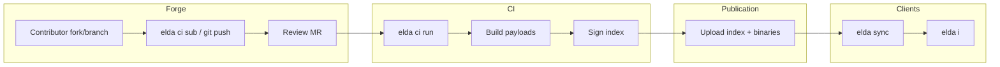

# Pattern: Full Elda Forge (Git + CI + Publish + Clients)

**Goal:** Contributors open PRs/MRs; CI builds and publishes signed indexes; users add your remote.

## Components

| Layer | Technology |
| --- | --- |
| Recipe Git | GitHub / GitLab / Gitea / Forgejo / etc. |
| Review | Host PR/MR + `elda ci pr` |
| Build | CI runner with Elda + toolchains |
| Index | Signed `index-v1.json.zst` on Releases or static HTTP |
| Optional cache | LAN or CDN digest mirror |
| Clients | `rmt add` + `sync` + `i` |

## Workflow



## Minimal `config.toml` (Maintainer Machine)

```toml
[submission]
mode = "pr"
auth = "token"
token_env = "ELDA_GITHUB_TOKEN"
api_base = "https://api.github.com"
base_branch = "main"
```

## Platform Guides

- [../platforms/github.md](../platforms/github.md)
- [../platforms/gitlab.md](../platforms/gitlab.md)
- [../platforms/gitea-forgejo.md](../platforms/gitea-forgejo.md)

## Start Small

Ship **source-only** index first; turn on binary fields when CI artifacts are reliable. See [../recommended-defaults.md](../recommended-defaults.md).
